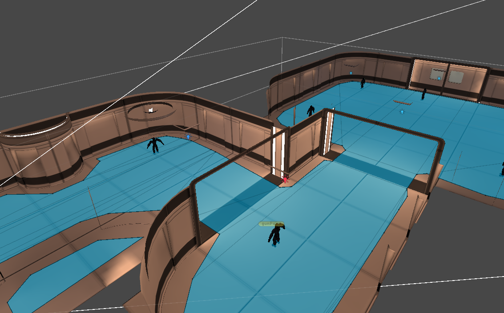
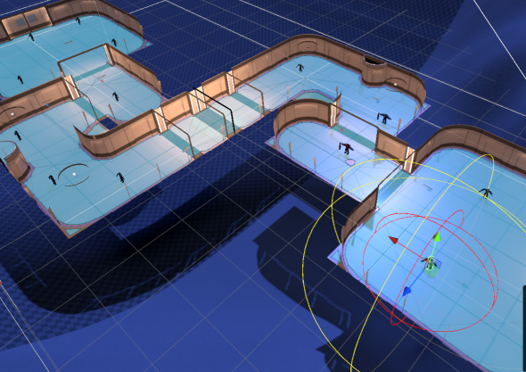

# OUA AI GAMEJAM Unity Grup 54

## Ekip

Anar Abasov

Mahmut Furkan Koçak

Etem Zemci Bildirici

Ayşenur Ustem

## Hikaye

Oyun Aegis uzay üssünde geçmektedir. İnsanlığın son umudu olan bu üs, isyankar robotların saldırısına uğramıştır. Oyuncu, zamanı kontrol etme gücüne sahip olan bir robot savaşçıyı kontrol eder. Görevi, üsse saldıran robotları alt ederek insanlığı kurtarmaktır. Zamanı yavaşlatma yeteneğiyle stratejik avantajlar sağlar ve düşmanlarını etkisiz hale getirir.

## Özellikler

### Third Person Shooter

Oyuncu, karakteri üçüncü şahıs bakış açısıyla kontrol eder.
Cinemachine ile TPS açısı sağlandı.

Karaktere zıplama, nişan alma, ölme mekanikleri ve animasyonları eklendi.

### AI - NavMesh NPC

NPC'ler NavMesh kullanarak hareket eder ve oyuncuyu hedef alır.
Oyuncu NPC'lere yaklaştığında NPC'ler oyuncuyu takip edip ateş eder.

### Zaman Yavaşlatma 

Oyuncunun zamanı yavaşlatma gücü vardır. "E" tuşuna tıklandığında bu özellik ile düşmanlar yavaşlar ve slowdown ses efekti çalışır.

## Kullanılan Assetler

Oyunda tamamen ücretsiz assetler kullanıldı.

https://assetstore.unity.com/packages/p/3d-free-modular-kit-85732

https://assetstore.unity.com/packages/p/3d-modern-menu-ui-116144

https://assetstore.unity.com/packages/3d/environments/sci-fi/lowpoly-spaceship-183012

https://assetstore.unity.com/packages/p/robot-soldier-142438

https://assetstore.unity.com/packages/p/skybox-series-free-103633

https://assetstore.unity.com/packages/3d/characters/robots/robot-hero-pbr-hp-polyart-106154

## Ekran Görüntüleri

  
